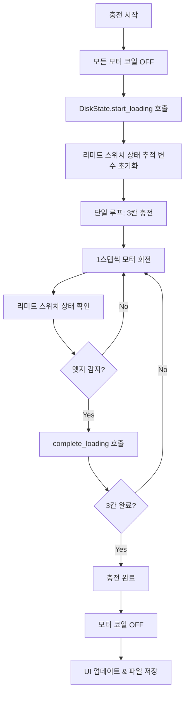

# Pill Loading Screen 모터 제어 로직 분석

## 📋 개요

Pill Loading Screen은 알약을 디스크에 충전하는 화면으로, 리미트 스위치 기반의 정밀한 모터 제어를 통해 3칸씩 연속으로 알약을 충전합니다.

## 🏗️ 아키텍처

### 1. 클래스 구조
```
PillLoadingScreen
├── DiskState (상태 관리)
├── PillBoxMotorSystem (모터 시스템)
└── UI Components (화면 구성요소)
```

### 2. 핵심 컴포넌트

#### **DiskState 클래스**
```python
class DiskState:
    def __init__(self, disk_id):
        self.disk_id = disk_id
        self.total_compartments = 15        # 총 15칸
        self.compartments_per_loading = 3   # 한 번에 3칸씩 충전
        self.loaded_count = 0               # 충전된 칸 수
        self.is_loading = False             # 현재 충전 중 여부
        self.current_loading_count = 0      # 현재 충전 중인 칸 수 (0-3)
```

#### **PillBoxMotorSystem**
- `StepperMotorController` 인스턴스 관리
- 74HC595D + ULN2003 스테퍼모터 제어
- 리미트 스위치 기반 정밀 제어

## 🔄 모터 제어 흐름

### 1. 전체 충전 프로세스



### 2. 핵심 함수: `_real_loading()`

#### **초기화 단계**
```python
def _real_loading(self, disk_index):
    # 1. 모터 시스템 검증
    if not self.motor_system or not self.motor_system.motor_controller:
        return False
    
    # 2. 충전 시작 전 모든 모터 코일 OFF (전력 소모 방지)
    self.motor_system.motor_controller.stop_all_motors()
    
    # 3. 충전 상태 시작
    if self.current_disk_state.start_loading():
        # 리미트 스위치 상태 추적 변수 초기화
        prev_limit_state = False
        current_limit_state = False
```

#### **메인 루프**
```python
# 단일 루프로 3칸 모두 처리
while self.current_disk_state.is_loading:
    # 1스텝씩 회전 (리미트 스위치 감지되어도 계속 회전) - 반시계방향
    self.motor_system.motor_controller.step_motor_continuous(disk_index, 1, 1)
    
    # 현재 리미트 스위치 상태 확인 (엣지 감지 정확성 위해 매 스텝 체크)
    current_limit_state = self.motor_system.motor_controller.is_limit_switch_pressed(disk_index)
    
    # 엣지 감지: 이전에 눌려있었고 지금 떼어진 상태
    if prev_limit_state and not current_limit_state:
        # 리미트 스위치 엣지 감지 시 충전 완료
        loading_complete = self.current_disk_state.complete_loading()
        
        # 3칸 충전이 완료되면 루프 종료
        if loading_complete:
            self._update_disk_visualization()  # 최종 상태 반영
            self._save_disk_states()
            break
    
    # 상태 업데이트 (매번 업데이트, 리셋 안함!)
    prev_limit_state = current_limit_state
```

#### **정리 단계**
```python
# 충전 완료 후 모터 코일 OFF (전력 소모 방지)
self.motor_system.motor_controller.stop_motor(disk_index)

# 완전히 충전된 경우 확인
if not self.current_disk_state.can_load_more():
    print("🎉 디스크 충전 완료! (15/15칸)")
    return True
```

## ⚡ 성능 최적화

### 1. 모터 제어 최적화 (2024년 적용)
- **변경 전**: 한 스텝마다 모든 모터 끄기/켜기
- **변경 후**: 전체 작업 전후로만 모터 제어

```python
# 최적화 전 (비효율적)
for each_step:
    stop_all_motors()
    motor_step()
    stop_all_motors()

# 최적화 후 (효율적)
stop_all_motors()  # 시작 전 한 번만
for each_step:
    motor_step()   # 순수한 모터 동작만
stop_motor()       # 완료 후 한 번만
```

### 2. UI 업데이트 최적화
```python
# 모터 회전 중에는 UI 업데이트 안함
# 3칸 완료 후에만 최종 업데이트
# 이렇게 하면 완전히 끊김 없는 부드러운 회전 가능
```

### 3. 리미트 스위치 엣지 감지
```python
# 엣지 감지 로직
if prev_limit_state and not current_limit_state:
    # 이전에 눌려있었고 지금 떼어진 상태 = 1칸 이동 완료
    loading_complete = self.current_disk_state.complete_loading()
```

## 🔧 모터 제어 세부사항

### 1. `step_motor_continuous()` 함수
```python
def step_motor_continuous(self, motor_index, direction=1, steps=1):
    """스테퍼모터 회전 (리미트 스위치 감지되어도 계속 회전) - 최적화된 성능"""
    for i in range(steps):
        # 각 모터의 독립적인 스텝 계산 (회전 방향 반대)
        self.motor_steps[motor_index] = (self.motor_steps[motor_index] - direction) % 8
        current_step = self.motor_steps[motor_index]
        
        # 모터 스텝 설정
        self.set_motor_step(motor_index, current_step)
        
        # 최대 속도로 회전 (0.5ms)
        time.sleep_us(500)
```

### 2. 리미트 스위치 기반 정밀 제어
- **엣지 감지**: 리미트 스위치가 눌렸다가 떼어지는 순간을 감지
- **정확한 위치 제어**: 물리적 리미트 스위치를 통한 정밀한 위치 확인
- **3칸 연속 충전**: 한 번의 세션에서 3칸씩 연속으로 충전

## 📊 상태 관리

### 1. DiskState 상태 전환
```
초기 상태 → 충전 시작 → 1칸 완료 → 2칸 완료 → 3칸 완료 → 충전 완료
```

### 2. 파일 기반 상태 저장
```python
# disk_states.json 파일에 상태 저장
{
    "saved_at": 813653389,
    "disk_2_loaded": 0,
    "disk_1_loaded": 0, 
    "disk_0_loaded": 0
}
```

## 🚨 에러 처리

### 1. 모터 시스템 초기화 실패
```python
try:
    self.motor_system = PillBoxMotorSystem()
    print("✅ 모터 시스템 초기화 완료")
except Exception as e:
    print(f"⚠️ 모터 시스템 초기화 실패: {e}")
    self.motor_system = None
```

### 2. 모터 제어 중 오류
```python
except Exception as e:
    print(f"❌ 모터 제어 중 오류: {e}")
    # 오류 발생 시에도 모터 정지
    self.motor_system.motor_controller.stop_motor(disk_index)
    return False
```

## 📈 성능 지표

### 1. 최적화 효과
- **75줄 코드 삭제**: 불필요한 모터 제어 로직 제거
- **로그 스팸 제거**: 한 스텝마다 출력되던 메시지 제거
- **CPU 부하 감소**: 과도한 모터 상태 변경 제거
- **전력 효율성**: 불필요한 모터 제어 제거

### 2. 동작 성능
- **부드러운 회전**: 끊김 없는 연속 모터 제어
- **정밀한 위치 제어**: 리미트 스위치 기반 정확한 위치 감지
- **안정적인 동작**: 에러 발생 시 안전한 모터 정지

## ⚠️ 모터 상태 위험성 분석

### 🚨 의도하지 않은 모터 활성화 가능성

#### **1. 예외 처리 중 모터 상태 불일치**

##### **위험 상황 1: 모터 시스템 초기화 실패**
```python
# PillLoadingScreen.__init__()
try:
    self.motor_system = PillBoxMotorSystem()
    print("✅ 모터 시스템 초기화 완료")
except Exception as e:
    print(f"⚠️ 모터 시스템 초기화 실패: {e}")
    self.motor_system = None  # ⚠️ 위험: None 상태
```

**위험성:**
- `self.motor_system = None` 상태에서 모터 제어 시도
- `_real_loading()` 함수에서 `None` 참조로 인한 예외 발생
- 예외 처리 중 모터가 의도하지 않은 상태로 남을 수 있음

##### **위험 상황 2: 모터 제어 중 예외 발생**
```python
# _real_loading() 함수 내부
try:
    while self.current_disk_state.is_loading:
        self.motor_system.motor_controller.step_motor_continuous(disk_index, 1, 1)
        # ... 리미트 스위치 감지 로직 ...
except Exception as e:
    print(f"❌ 모터 제어 중 오류: {e}")
    self.motor_system.motor_controller.stop_motor(disk_index)  # ⚠️ 부분적 정지만
    return False
```

**위험성:**
- 예외 발생 시 해당 모터만 정지 (`stop_motor(disk_index)`)
- **다른 모터들의 상태는 확인하지 않음**
- 다른 모터가 의도하지 않게 켜진 상태로 남을 수 있음

#### **2. 상태 관리 불일치**

##### **위험 상황 3: DiskState와 실제 모터 상태 불일치**
```python
# DiskState 상태 관리
def complete_loading(self):
    if self.is_loading:
        self.current_loading_count += 1
        self.loaded_count += 1
        if self.current_loading_count >= 3:
            self.is_loading = False  # ⚠️ 소프트웨어 상태만 변경
            return True
```

**위험성:**
- `DiskState.is_loading = False`로 변경되지만
- **실제 하드웨어 모터 상태는 별도로 관리됨**
- 소프트웨어 상태와 하드웨어 상태 불일치 가능성

##### **위험 상황 4: 비블로킹 모터 제어 변수 오염**
```python
# StepperMotorController 초기화
self.motor_running = [False, False, False, False]  # 비블로킹 제어 상태
self.motor_direction = [1, 1, 1, 1]  # 각 모터별 방향
```

**위험성:**
- `motor_running` 상태가 예외적으로 `True`로 남을 수 있음
- 다른 화면에서 비블로킹 모터 제어 사용 시 상태 오염
- Pill Loading Screen 진입 시 의도하지 않은 모터 동작

#### **3. 하드웨어 레벨 위험성**

##### **위험 상황 5: 74HC595D 출력 상태 불안정**
```python
# shift_out() 함수 - 타이밍 문제
def shift_out(self, data):
    for i in range(8):
        bit = (data >> (7 - i)) & 1
        self.di.value(bit)
        self.sh_cp.value(1)  # ⚠️ 딜레이 없음
        self.sh_cp.value(0)
```

**위험성:**
- 타이밍 딜레이 없이 연속 GPIO 전환
- 74HC595D 출력이 불안정한 상태로 고정될 수 있음
- **모터가 의도하지 않은 전류를 받아 계속 켜진 상태 유지**

##### **위험 상황 6: 전원 공급 불안정**
```python
# 모터 초기화 시
self.turn_off_all_coils()  # 모든 코일 OFF 설정
```

**위험성:**
- 전원 공급 불안정 시 74HC595D 출력이 예측 불가능한 상태
- **전원 복구 시 모터가 의도하지 않게 켜질 수 있음**

### 🛡️ 위험성 완화 방안

#### **1. 강화된 예외 처리**
```python
def _real_loading(self, disk_index):
    try:
        # 모터 시스템 검증 강화
        if not self.motor_system or not self.motor_system.motor_controller:
            print("❌ 모터 시스템이 초기화되지 않음")
            return False
        
        # 시작 전 모든 모터 강제 정지
        self.motor_system.motor_controller.stop_all_motors()
        
        # 모터 제어 로직...
        
    except Exception as e:
        print(f"❌ 모터 제어 중 오류: {e}")
        # ⚠️ 모든 모터 강제 정지 (부분 정지 대신)
        try:
            self.motor_system.motor_controller.stop_all_motors()
        except:
            pass  # 최후의 수단
        return False
    finally:
        # ⚠️ 항상 실행되는 정리 로직
        try:
            self.motor_system.motor_controller.stop_all_motors()
        except:
            pass
```

#### **2. 상태 동기화 검증**
```python
def _verify_motor_state(self):
    """모터 상태 검증"""
    try:
        if self.motor_system and self.motor_system.motor_controller:
            # 모든 모터가 정지 상태인지 확인
            for i in range(4):
                if self.motor_system.motor_controller.motor_states[i] != 0x00:
                    print(f"⚠️ 모터 {i}가 예상과 다른 상태: 0x{self.motor_system.motor_controller.motor_states[i]:02X}")
                    # 강제로 정지
                    self.motor_system.motor_controller.motor_states[i] = 0x00
            self.motor_system.motor_controller.update_motor_output()
    except Exception as e:
        print(f"❌ 모터 상태 검증 실패: {e}")
```

#### **3. 하드웨어 안정성 강화**
```python
def shift_out(self, data):
    """74HC595D에 8비트 데이터 전송 (타이밍 개선)"""
    for i in range(8):
        bit = (data >> (7 - i)) & 1
        self.di.value(bit)
        time.sleep_us(1)  # ⚠️ 타이밍 딜레이 추가
        
        self.sh_cp.value(1)
        time.sleep_us(1)  # ⚠️ 타이밍 딜레이 추가
        self.sh_cp.value(0)
        time.sleep_us(1)  # ⚠️ 타이밍 딜레이 추가
    
    self.st_cp.value(1)
    time.sleep_us(1)  # ⚠️ 타이밍 딜레이 추가
    self.st_cp.value(0)
```

### 📊 위험성 평가

| 위험 상황 | 발생 확률 | 영향도 | 우선순위 |
|-----------|-----------|--------|----------|
| 모터 시스템 초기화 실패 | 중간 | 높음 | 🔴 높음 |
| 모터 제어 중 예외 발생 | 높음 | 중간 | 🟡 중간 |
| 상태 관리 불일치 | 중간 | 중간 | 🟡 중간 |
| 비블로킹 모터 상태 오염 | 낮음 | 높음 | 🟡 중간 |
| 74HC595D 출력 불안정 | 낮음 | 높음 | 🔴 높음 |
| 전원 공급 불안정 | 낮음 | 매우 높음 | 🔴 높음 |

### 🎯 권장 조치사항

#### **즉시 적용 (높은 우선순위)**
1. **모든 예외 처리에 `finally` 블록 추가**
2. **모터 제어 전후로 상태 검증 로직 추가**
3. **74HC595D 타이밍 딜레이 추가**

#### **단기 개선 (중간 우선순위)**
1. **모터 상태 모니터링 시스템 구축**
2. **비블로킹 모터 상태 격리**
3. **하드웨어 레벨 안전장치 추가**

#### **장기 개선 (낮은 우선순위)**
1. **전력 관리 시스템 개선**
2. **모터 상태 백업 및 복구 시스템**
3. **예측적 안전 모니터링**

---

## 🔮 향후 개선 방향

1. **비동기 모터 제어**: UI 블로킹 없는 모터 제어
2. **적응형 속도 제어**: 리미트 스위치 근처에서 속도 조절
3. **모터 상태 모니터링**: 실시간 모터 상태 및 온도 감시
4. **예측적 유지보수**: 모터 수명 예측 및 교체 알림

---

*이 문서는 Pill Loading Screen의 모터 제어 로직을 상세히 분석한 결과입니다. 실제 구현은 `src/screens/pill_loading_screen.py`와 `src/motor_control.py`를 참조하세요.*
